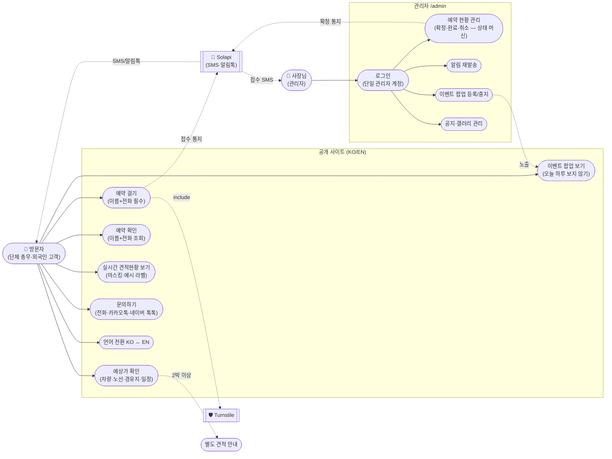
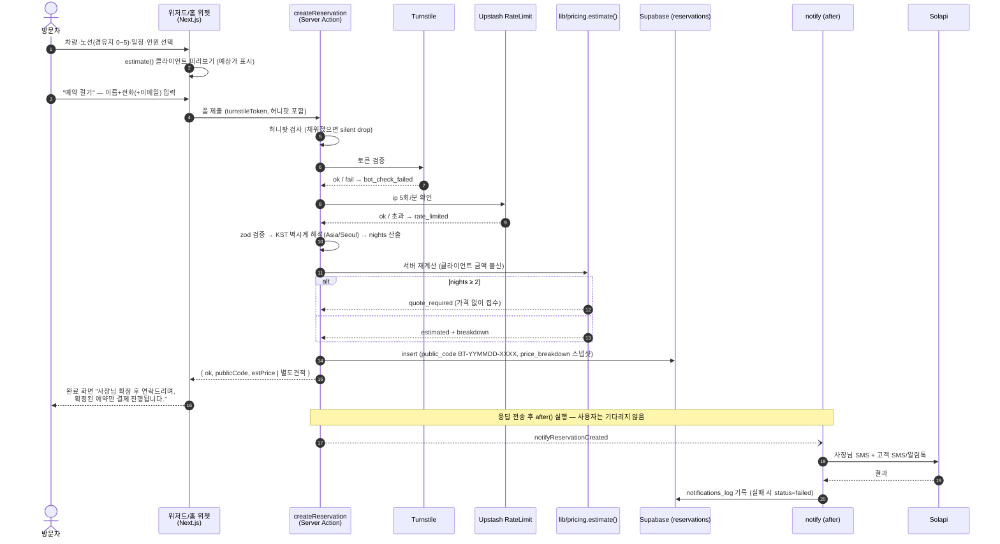
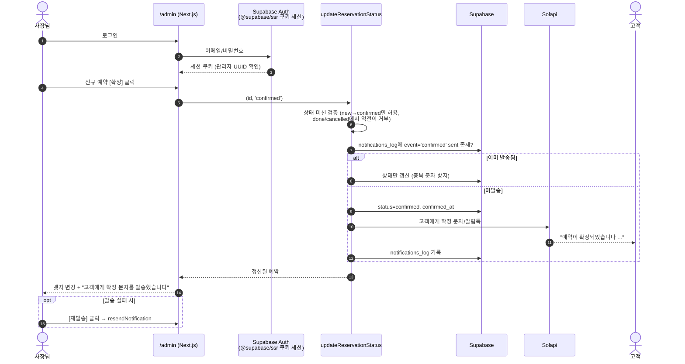
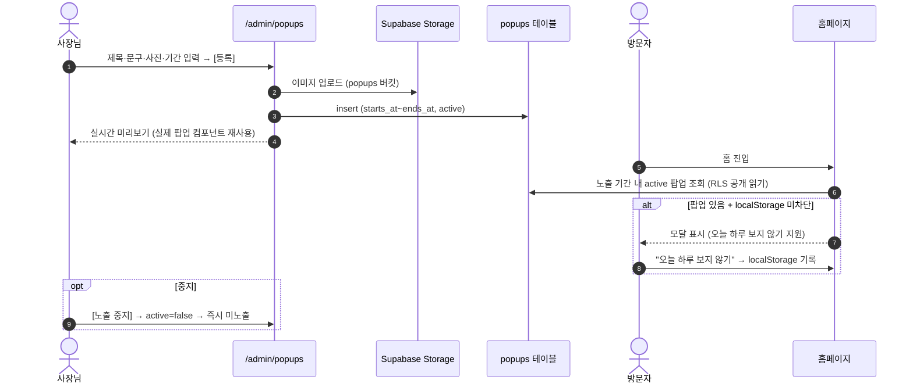

# 베스트투어 — Use Case & Sequence Diagrams

플랜 v2 (docs/superpowers/plans/2026-08-15-bestour-implementation-master.md) 기준.
GitHub·Claude Artifact에서 mermaid로 렌더됩니다.

## 1. Use Case Diagram

## 2. Sequence — 예약 접수 (핵심 플로우)

## 3. Sequence — 사장님 확정 & 통지

## 4. Sequence — 이벤트 팝업 (등록 → 노출)

